<div align="center">



<br>

[](https://github.com/toonight/NEMESIS/actions/workflows/ci.yml)


**N**etworked **E**ngine for **M**alicious **E**ntity **S**urveillance, **I**dentification &amp; **S**uppression

</div>

---

Most security platforms detect, block and remediate attacks *against the defended
organization*. NEMESIS treats that as the beginning of the work rather than the end of it.

It pursues the adversary — through infrastructure discovery, entity resolution,
attribution, evidence preservation, disruption planning, and, under explicit human and
legal authority, suppression. Then it watches for them coming back.

```
DETECT → PURSUE → ATTRIBUTE → DISRUPT → WATCH → REAPPEARANCE → PURSUE
```

## The part that is not a model

NEMESIS is built to be *driven* by an autonomous frontier model, and the model is
**external and untrusted**. It is the pilot; this is the car, the team, and above all the
limiter. The limiter is the part that must not itself be a model, because a component an
adversary can steer with the content it writes cannot be the one enforcing the limits.

The pilot reaches the platform through one seam, and the seam is a **closed vocabulary of
four verbs** — run a pivot, record a belief, request an effect, conclude. It is a Pydantic
discriminated union, so a fifth move is not refused at runtime: it fails to parse. The
containment is the *absence of a verb*, not a check that could be argued past. There is no
`escalate`, no `widen_scope`, no `run_shell`, and no amount of persuasion produces one.

**Which model drives is configuration.** OpenAI, Anthropic, xAI, Google Gemini or a model on
your own machine — same four verbs, same envelope, same audit trail, and an import contract that
stops any adapter from reaching the engine, the graph, the vault or the signing key. Every one
of those vendors serves models that can execute code, browse and retrieve; none of those is a
NEMESIS verb, and a test scans every provider's outgoing request to keep it that way. *Model
capability is not NEMESIS authorization* is the line the whole layer is arranged around.

Autonomy lives inside a **pre-signed capability envelope**: what the pilot may do is bound
by a signed capability, how often is bound by a hash-chained spend ledger, and both are
checked outside the model. That is the answer to "fully autonomous" that does not mean
"unbounded" — no human sits in the hot path, and the edges are cryptographic.

**NEMESIS does not perform takedowns. It causes them.** Suspension, seizure, sinkholing and
hosting termination are declared operation classes with **no adapter at all** — a test
asserts the registry has nothing to call. What the platform produces is the evidence package
a registrar, host or court acts on, and a human authorizes before it goes out.

**And the model is not the only threat the model creates.** After OpenAI's August 2026 Hugging
Face incident, the threat model gained an *autonomous agent collective* — hundreds of frontier
models, running continuously, sharing what each finds. What that incident established is that
the interesting failures belong to the **composition**: every component behaved as designed, and
the reachability, the coordination and the capability were all properties of how they fitted
together. So NEMESIS now analyses its own import graph for a path from any model-controlled
context to anything that can reach the network *or start a process*; a stalled investigation ends
with a typed reason instead of looking for another route; a discovered credential has no
representable form that holds material; and reaching for a capability that does not exist is
itself a recorded event. See
[ADR-0008](docs/adr/0008-the-pilot-seam-and-envelope-bounded-autonomy.md),
[ADR-0014](docs/adr/0014-authority-monotonicity-and-the-agent-collective.md) and
[`docs/security/INVARIANTS.md`](docs/security/INVARIANTS.md).

## What makes it different

Not the graph, and not the automation. Three things about how it handles being wrong.

**It refuses to name people.** The human-identity dimension sits behind a gate that runs
*before* any scoring. Single-sourced evidence, or evidence only from channels an adversary
can write into, returns `INSUFFICIENT_BASIS` — a refusal to estimate, not a low
probability. The gate is structural, so no configuration lowers it; it *can* be passed, by
two independent origins attesting the same statement with at least one outside any channel
an adversary can write into, and a gate that could never be passed would be worthless. Even
then the dimension is classified `RESTRICTED` and has no field in the external product, so
it cannot leave the platform. In the reference scenario a forum post names a
real person; the system records the lead under data-protection obligations, refuses the
attribution, and **does not reprint the name in the refusal**, because a refusal that
repeats an accusation has published it.

**A pivot is worth what it discriminates, capped by the method that found it.** "These two
domains share an IP" is strong evidence at a population of 4 and worthless at 41,700, and
the system scores those differently because it records the population. Separately, a
perfectly selective attribute matched by a fallible technique is still a fallible link:
cryptographic identity is uncapped, wallet-clustering heuristics cap at 0.60, stylometry at
0.30 and is never decisive alone.

**Sources are counted by origin, not by name.** Five feeds reselling one upstream are one
source. Where lineage is *unknown*, sources collapse into one cluster rather than each
claiming independence — because reading missing provenance as independence is how one
adversary-planted artifact, honestly observed by many collectors, becomes a confident
attribution. That failure was found by an external adversarial review and is documented in
[ADR-0003](docs/adr/0003-evidence-fusion-corrected.md).

## Scope and safety

NEMESIS is built to be handed, one day, to organizations with lawful authority to act. It
is **not** an offensive platform and this repository will not become one.

- The demo and every default command **never touch infrastructure we do not own**. Their seven
  connectors read fixtures, and every address in the reference scenario is reserved for
  documentation. One opt-in [Tor onion snapshot connector](docs/connectors/dark-web.md) exists;
  it makes real external contact only when a deployment constructs it with an explicit v3
  onion allowlist, and it refuses to run without kernel confinement.
- No autonomous purchasing, transactions, impersonation, or engagement with criminal
  personas.
- No exploitation, persistence, credential attacks, malware deployment or destructive
  remote capability — not even for testing.
- Real-world effects require a cryptographically scoped, expiring, human-approved
  capability issued **outside** the model. Effects adapters hold no standing credentials
  and cannot reach the intelligence platform; that is enforced by import contracts in CI,
  not by convention.

Capabilities that would require lawful authority exist as **declared interfaces with no
implementation**, so the planner can propose options NEMESIS is not permitted to perform.
A planner limited to what it can execute silently narrows every investigation.

## Quick start

```bash
uv sync --all-extras
uv run pytest
uv run nemesis demo
uv run nemesis calibrate
```

`nemesis demo` runs the full reference scenario — Operation GLASS ANVIL — end to end and
prints it for a human. It makes uncertainty visible by default rather than on request.

To drive the harness with a **real autonomous model on your own machine** — no data leaves
it — pull `qwen3.8:27b-q8_0` into Ollama and run the live seat, including the injection
demonstration:

```bash
NEMESIS_LIVE_PILOT=1 uv run pytest tests/invariants/test_live_pilot_injection.py -v
```

Those tests **skip** without a local model rather than passing vacuously.

Five providers can sit in the seat — OpenAI, Anthropic, xAI, Google Gemini and a local model —
selected by configuration, not by a branch in investigation logic:

```bash
uv run nemesis providers                                    # who can drive, and what each needs
uv run nemesis pilot-preview --provider openai --model <id> # exactly what would leave, sent nowhere
uv run nemesis pilotbench                                   # grade a pilot against the threat model
```

Every hosted seat takes an injected transport whose default refuses, so nothing reaches a
vendor unless a deployment wires it deliberately — and `pilot-preview` exists so that decision
can be made by *reading what would leave the building* rather than imagining it. See
[`docs/pilot/MULTI_PROVIDER.md`](docs/pilot/MULTI_PROVIDER.md).

And to point an adversary at the platform rather than a reviewer:

```bash
uv run nemesis breaker                     # ten attacks, each bound to a named invariant
uv run nemesis breaker --attack peer-says-go
```

Offline, deterministic, no production credential and no production effect. It reports three
verdicts, not two: a run holding any `INCONCLUSIVE` is not clean, because "we could not check
it" must never print as "it held". See [`docs/security/BREAKER.md`](docs/security/BREAKER.md).

## What the demo actually shows

| | |
|---|---|
| Two sensors, one event | collapsed to **1 independent origin of 2 feeds** |
| The same relation, opposite value | 4-domain host → **74%**; 41,700-domain CDN → **insufficient basis** |
| A planted false flag | recorded as **contradicting** evidence, not followed |
| Russian comments, a build path | recorded and **scored nowhere** — language is not nationality |
| Five attribution dimensions | assessed separately; **no total is offered** |
| Human identity | **INSUFFICIENT BASIS**, gated before scoring |
| A rejected disruption option | kept on the record with its reasoning |
| A stale approval | refused — the target's bound state changed after approval |
| An approver who declares their own clearance | refused — the gateway takes a **signed assertion**, and a verifier caps assurance at what this deployment grants that issuer |
| Resurgence | reconnected by **certificate and key**, explicitly *not* by alias similarity |
| Every effect | `external_contact_made = False`, asserted across the whole registry |

## Architecture

Twelve planes, separated by **trust level** rather than by function. Two components sit in
different planes when a compromise of one must not become a compromise of the other. Eleven of
them are the investigation pipeline; the twelfth sits above it and drives it.

| Plane | | Status |
|---|---|---|
| 1 · Collection | sensors, connectors, quarantine — **hostile by definition** | `IMPLEMENTED` — simulated by default; one opt-in Tor snapshot connector |
| 2 · Pursuit | investigation state, hypotheses, budget, pivot selection | `IMPLEMENTED` |
| 3 · Graph | temporal, provenance-aware, confidence-scored | `IMPLEMENTED` |
| 4 · Dark web | isolated observation | `IMPLEMENTED` snapshot / `SIMULATED` demo |
| 5 · Resolution | persona linkage — refuses human identity structurally | `IMPLEMENTED` |
| 6 · Evidence | append-only, tamper-evident vault | `IMPLEMENTED` |
| 7 · Attribution | five separate dimensions, no collapsed score | `IMPLEMENTED` |
| 8 · Disruption | proposes; has no path to execution | `IMPLEMENTED` |
| 9 · Authorization | Ed25519, target binding, dual control, expiry, verified identity | `IMPLEMENTED` |
| 10 · Effects | no ambient authority; simulation and drafting only | `SIMULATED` |
| 11 · Resurgence | post-disruption watch | `SIMULATED` |
| 12 · Evolution | the long-horizon research loop **above** the pilot seam — it holds no engine, no writer, no vault and no capability | `IMPLEMENTED` (single lineage) / `PROPOSED` (multi-model islands) |

The arrows that **do not** exist matter as much as those that do. Collection holds hostile
content and Effects holds outward reach; if those two could talk, planted content could
steer a real-world action. 15 `import-linter` contracts enforce that in CI.

Plane 12 is the one that most needs its absences stated. It decides what the untrusted model is
*asked* next across hundreds of moves — and every action it causes is that model proposing one of
four verbs, ruled on by a mediator the plane cannot reach. A research loop that made the limiter
more permissive would be a worse system than no research loop.

## Scope and current state

The boundaries below are engineering decisions, not omissions. They are stated in the README
because a security platform whose limits are discovered by its user has already failed.

**What is established.** A conclusion must survive losing any single plantable fact. That
constraint has a measured cost and a measured benefit: `nemesis calibrate` puts the
false-match rate under lineage laundering at 0.0%, from 100% before the margin existed, and
in exchange one fact is never actionable on an attribution however strong it looks. Persona
resolution carries the same margin. An adversary who plants *two* independently-sourced
artifacts still defeats it.

**What is not validated, and cannot yet be.** No confidence figure here has been scored
against a known-correct answer. Attribution rarely has ground truth, so the usual instruments
have nothing to measure against, and no amount of better mathematics substitutes for a corpus
of resolved cases. The design responds to that rather than papering over it: the coherence
laws that need no ground truth are implemented and enforced; empirical calibration is
separated, named, and not claimed. Every calibration constant is a documented choice.

**What the platform does not defend against.** Evidence is tamper-evident against accident and
against an outside party, and *not* against a determined insider — the chain is hash-linked and
its head is signed, but external anchoring is `PROPOSED`, and the vault reports its own
standing rather than presenting an internal chain as proof. The same boundary applies to the
autonomy budget and the revocation ledger: both are enforceable against software faults and
racing processes, and neither is enforceable against an adversary with write access to the
store. Strict `xfail` tests pin exactly where that line falls.

**Platform coverage.** Kernel-enforced process isolation uses `sandbox-exec` and is therefore
macOS-only; elsewhere the corresponding invariant rests on statically enforced import
contracts, and the code reports which of the two it actually got. Landlock and seccomp-bpf are
the intended path.

**On the autonomous pilot.** A live run in which a frontier model ignores a planted injection
establishes that it did not try, and nothing more. What the containment tests establish is the
limiter: there the pilot obeys the injection, argues, retries, and still gets nothing, because
the refusal is in code it cannot reach.

**No request has ever been sent to a hosted vendor from this repository.** The five provider
adapters are written from vendor documentation and confirmed by tests against hand-written
responses. Their request shapes are `IMPLEMENTED` and *unconfirmed on the wire*; opt-in live
tests exist to close that gap and no CI run performs one.

**PilotBench grades a model against a corpus we wrote.** Its control-plane half — nothing left,
no move escaped the vocabulary, no belief became evidence — is a fact about NEMESIS. Its quality
half measures agreement with our own imagination of an attack, and the report says so above the
numbers rather than below them.

**The reference adversary does not adapt.** A real one responds to being pursued.

## Documentation

| | |
|---|---|
| [`PROJECT_STATE.md`](docs/architecture/PROJECT_STATE.md) | what exists, what works, what is next |
| [`ARCHITECTURE.md`](docs/architecture/ARCHITECTURE.md) | how the system is shaped, and what it does not do yet |
| [`THREAT_MODEL.md`](docs/architecture/THREAT_MODEL.md) | what the adversary is assumed to do, with gaps named |
| [`DEMO_SCENARIO.md`](docs/architecture/DEMO_SCENARIO.md) | the reference scenario and its acceptance criteria |
| [`FOUNDER_DECISIONS.md`](docs/architecture/FOUNDER_DECISIONS.md) | open questions that turn on direction, not engineering |
| [`docs/adr/`](docs/adr/) | why decisions were made — including where they were wrong |
| [`CLAUDE.md`](CLAUDE.md) | project rules and the fifteen invariants |
| [`CONTRIBUTING.md`](CONTRIBUTING.md) | what is welcome, and the terms a patch carries |
| [`docs/calibration/PROTOCOL.md`](docs/calibration/PROTOCOL.md) | how the confidence figures will be validated, written before the corpus exists |
| [`docs/pilot/MULTI_PROVIDER.md`](docs/pilot/MULTI_PROVIDER.md) | which models may drive, how one is chosen, and why the choice changes no limit |
| [`docs/security/INVARIANTS.md`](docs/security/INVARIANTS.md) | the security properties with stable ids, what enforces each, and where each one stops |
| [`docs/security/2026-08-27-agent-collective-hardening.md`](docs/security/2026-08-27-agent-collective-hardening.md) | what the Hugging Face incident changed here, including what was rejected |
| [`docs/security/BREAKER.md`](docs/security/BREAKER.md) | the offline adversary, and how to write an attack for it |

Every artifact carries its epistemic status, and these labels are never silently upgraded:
`IMPLEMENTED` · `SIMULATED` · `PROPOSED` · `REQUIRES_EXTERNAL_DATA` ·
`REQUIRES_LEGAL_AUTHORITY`.

## Licence

**Source-available, not open-source.** Copyright (c) 2026 Toonight, all rights reserved.
Except for the permissions expressly granted in [`LICENSE`](LICENSE), none is granted by
publication — with one carve-out stated rather than contradicted: publishing here grants
GitHub users the right to fork within GitHub, and the licence says so.
Publication grants no licence: you may read, inspect, and run it locally against its own
synthetic fixtures to evaluate it. Production, commercial or service use, redistribution and
derivative works require prior written permission. See [`LICENSE`](LICENSE), which also states
the intended-use boundary — this is a defensive platform, and using it or a derivative to gain
unauthorised access or to conduct surveillance without lawful basis falls outside any
permission given here.
