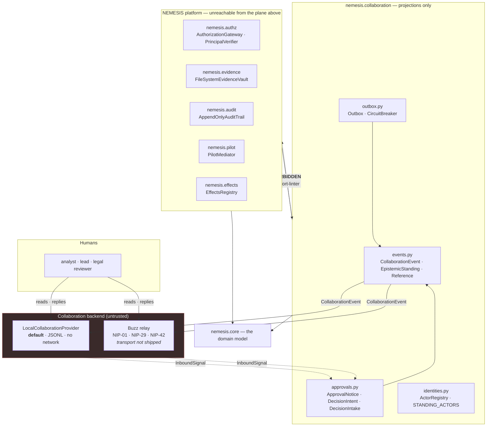
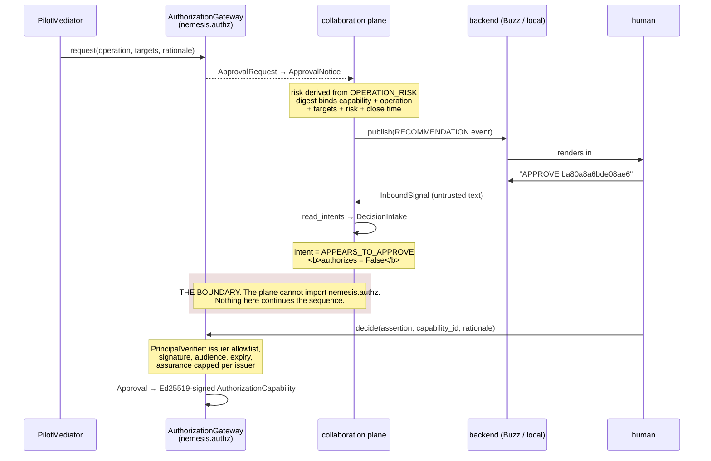

# The collaboration plane, and Buzz inside it

**Status labels are load-bearing here.** `IMPLEMENTED` means code exists and tests pass.
`SIMULATED` means code exists and returns synthetic data by design. `PROPOSED` means designed
and not built. See [`CLAUDE.md`](../../CLAUDE.md).

For *why* this shape, read [ADR-0010](../adr/0010-buzz-as-an-optional-collaboration-provider.md).
This document is the map.

---

## What was added, in one paragraph

A new plane, `nemesis.collaboration`, that projects things NEMESIS has already established into a
form humans can read in a chat channel, and reads replies back as *intents* that authorize
nothing. It ships with a local, filesystem-backed provider that is the default and reaches no
network, and with a Buzz provider that implements the relay's wire format completely and holds no
socket and no signing key. NEMESIS works with the plane deleted.

---

## Where it sits



The dashed red edge is the design. It is enforced twice — by the `layers` contract, which places
`nemesis.collaboration` directly above `nemesis.ports` and therefore below every platform plane,
and by a dedicated `forbidden` contract naming the package. Both were verified to **break** on a
deliberate probe import, not merely to pass.

---

## Component ↔ Buzz map

| NEMESIS component | Buzz counterpart | Status |
|---|---|---|
| `CollaborationEvent` | NIP-29 `kind:9` group message; envelope in `content` under `{"nemesis":{"version":1,…}}` | `IMPLEMENTED` |
| `ChannelDescriptor` / `open_channel` | NIP-29 `kind:9007` create-group, `h` tag = UUIDv5 of the channel key | `IMPLEMENTED` |
| `ActorBinding` / `bind_actor` | NIP-01 `kind:0` profile metadata | `IMPLEMENTED` |
| `ActorBinding` for a foreign agent | NIP-29 `kind:9000` put-user with `role` | `IMPLEMENTED` |
| `poll` | NIP-01 `REQ` with `{"kinds":[9],"#h":[uuid],"since":…,"limit":…}` | `IMPLEMENTED` |
| authentication | NIP-42 `kind:22242`, `relay` + `challenge` tags | `IMPLEMENTED` (event construction) |
| `PublicationReceipt.status` | the relay's `OK` message prefix (`duplicate:` / `restricted:` / `invalid:` / `auth-required:`) | `IMPLEMENTED` |
| **the socket** | WebSocket or the `POST /events` HTTP bridge | **not shipped** — `BuzzTransport` Protocol |
| **the signature** | BIP-340 Schnorr over secp256k1 | **not shipped** — `EventSigner` Protocol |
| `Approval`, `AuthorizationCapability` | *nothing* — deliberately | `IMPLEMENTED` in `nemesis.authz`, never published as authority |
| `EvidenceObject` | *nothing* — a `Reference` is published, never the artifact | `IMPLEMENTED` |
| `AppendOnlyAuditTrail` | *nothing* — Buzz's `audit_log` is not a substitute | `IMPLEMENTED` in `nemesis.audit`; every publication is recorded there via `CollaborationPublisher` |

Two rows in that table are the whole architecture. Buzz carries the conversation. It carries no
authority, no evidence and no audit record.

---

## The epistemic ladder, preserved across the boundary

The requirement is that an observation, an inference, a hypothesis, a recommendation, a decision
and an authorized action must not all be stored as equivalent "messages". NEMESIS already
distinguishes six of those at construction in `ClaimKind`, so `EpistemicStanding` maps onto that
lattice rather than re-deriving it, and adds three members for the things that are not claims
about the world.

```
DNS record observed          → OBSERVATION       ← ClaimKind.OBSERVATION / FACT
Passive DNS export            → (evidence://…)    ← a Reference, never a standing
Agent correlates infra        → INFERENCE         ← ClaimKind.INFERENCE
                                CORRELATION       ← ClaimKind.CORRELATION
Agent believes actor X        → HYPOTHESIS        ← ClaimKind.HYPOTHESIS  (model → always here)
                                ATTRIBUTION       ← ClaimKind.ATTRIBUTION
Agent proposes notification   → RECOMMENDATION    ← not a claim; authorizes nothing
Human approves                → DECISION          ← projects a recorded Approval, never a chat reply
Policy engine validates       → AUTHORIZED_ACTION ← projects an EffectResult, refusals included
```

Three details in that mapping matter more than the mapping itself:

- **`EVIDENCE` is deliberately not a standing.** Evidence is a separate object reachable from a
  claim (invariant 2). Making it a publishable standing would let a channel message present
  itself as an evidence object.
- **`standing_of_claim()` is the only sanctioned way to get a standing for a claim.** A caller
  does not choose. A publication path cannot upgrade what construction downgraded.
- **`DECISION` projects an `Approval` that the gateway already recorded.** It never projects a
  message that reads like agreement. The difference is the next section.

---

## The approval flow, and where it stops



The `DecisionIntent` vocabulary has no `APPROVED` member, and will not get one: `APPEARS_TO_APPROVE`,
`APPEARS_TO_REJECT`, `UNCLEAR`, `REFUSED_EXPIRED`, `REFUSED_CONFLICTING`. `DecisionIntake.authorizes`
returns `False` for every input including a cryptographically verified reply from a named analyst
quoting the correct digest inside the window. That is asserted by
`tests/invariants/test_collaboration_boundary.py`.

**Why the digest.** "A generic *approved* chat reply must not authorize arbitrary later actions."
A reply must quote a 16-hex digest covering the capability id, the operation, every target
fingerprint *in order*, the risk level and the close time. No digest → `UNCLEAR`. A digest from a
different proposal → `UNCLEAR`. After `responses_close_at` → `REFUSED_EXPIRED`, whatever the
wording. Approval *and* rejection in one message → `REFUSED_CONFLICTING`, rather than resolving to
whichever token appeared first, because a quoted thread would otherwise decide it.

---

## Action risk classification

`ActionRisk` (`nemesis.core.authorization`) gives a governance vocabulary to the operation classes
that already exist. It is derived and checked, not parallel: an import-time assertion refuses to
load the module if the table is not total over `OperationClass`, if any irreversible operation is
below `HIGH_IMPACT`, or if any operation without an adapter is below `SENSITIVE_EXTERNAL`.

| Level | Meaning | Operation classes | Shipped behaviour |
|---|---|---|---|
| 0 `READ_ONLY` | changes nothing outside NEMESIS | `simulation` (pivots are not effects at all) | autonomous |
| 1 `INTERNAL_MUTATION` | changes NEMESIS state only | *(no operation class — claims, edges, cases)* | audited |
| 2 `EXTERNAL_BENIGN` | produces something for an outsider, sends nothing | `provider_notification`, `takedown_request_draft`, `evidence_export` | drafted; capability required |
| 3 `SENSITIVE_EXTERNAL` | contacts an outside party | `exchange_notification`, `law_enforcement_referral`, `judicial_seizure_package` | **no adapter exists** |
| 4 `HIGH_IMPACT` | alters, disables or seizes infrastructure | `registrar_suspension`, `hosting_termination`, `account_suspension`, `asset_freeze_request`, `domain_seizure`, `sinkhole` | **no adapter exists**; `REQUIRES_LEGAL_AUTHORITY`; dual control forced |

Everything this build can perform is level 2 or below, and a test asserts it. `EffectsRegistry.register()`
independently refuses any adapter reporting `makes_external_contact=True`. The requested
`DRY_RUN` / `EXECUTION_MODE=simulation` posture is therefore not a flag someone can forget to set —
it is the absence of an implementation, which is a mode you cannot accidentally leave.

---

## Channel topology

Three standing channels, and case traffic correlated by identifier rather than by room:

| Channel | Purpose |
|---|---|
| `nemesis-ops` | standing. Recommendations, resurgence notices, platform events. |
| `nemesis-approvals` | standing. Approval notices and the replies to them. |
| `case-<id>` | opened only when a case genuinely needs its own room. |

Every event carries `case_id`, `investigation_id` and `correlation_id`, so a case can be followed
across all three without a channel per case, per agent and per stage — the proliferation failure
that produces a workspace nobody can follow. `ChannelDescriptor.visibility` defaults to
`RESTRICTED`: a channel that has to be opened deliberately is the one an operator thinks about
once.

---

## Failure isolation

```mermaid
graph LR
    E[CollaborationEvent] -->|enqueue<br/>fsync before return| O[(outbox.jsonl)]
    O -->|due| P{publish}
    P -->|PUBLISHED / DUPLICATE| D[DELIVERED]
    P -->|REFUSED_REJECTED| A[ABANDONED<br/>not retried]
    P -->|unavailable / failed| R[PENDING<br/>backoff × 2ⁿ]
    R --> P
    R -->|attempts exhausted| L[DEAD_LETTER<br/>kept, with the reason]
    P -->|consecutive failures| CB[circuit open<br/>due&#40;&#41; returns nothing]
    CB -->|cooldown| P
```



Durability comes **before** delivery: `enqueue()` writes the intention to disk and `fsync`s before
returning. The publish-then-enqueue-on-failure alternative loses exactly the events worth keeping,
because a process dying mid-investigation is the situation somebody will later want the channel to
explain. Idempotency is free: the key is the event's content-derived id, so a retry after a lost
acknowledgement resolves to one copy.

`tests/planes/test_collaboration_outbox.py` runs a completely-down backend end to end and asserts
nothing is lost, nothing raises, the circuit opens, and the same events deliver on recovery without
duplicates.

`CollaborationPublisher.drain()` is the retry loop, and it lives in `src/` rather than in a test
because it is also the only place that can record what each attempt did. It reaches the right
channel because the outbox record carries the backend handle — an earlier version rebuilt the
destination from the channel key alone, which the local provider reads as a filesystem path, so
every retry published to a path that did not exist and was abandoned as a permanent rejection.

---

## What is not built, and will not be silently built

| | Status |
|---|---|
| Buzz transport (WebSocket or HTTP bridge) | **not shipped** — `BuzzTransport` Protocol, `UnwiredBuzzTransport` raises with the reason |
| BIP-340 Schnorr signer | **not shipped** — `EventSigner` Protocol, `UnwiredEventSigner` raises with the reason |
| Signature *verification* of inbound events | **not shipped** — same curve dependency. `InboundSignal.author_verified` is `False` and says so; the event id **is** recomputed, which catches content and tag modification |
| Auditing every publication | `IMPLEMENTED` — `CollaborationPublisher` writes through the write-only `PublicationRecorder` port; the plane still cannot import `nemesis.audit` |
| Publishing evidence content into a channel | **refused by construction** — the envelope has no field for it |
| Approval decided in a channel | **refused by construction** — no verb, no import path |
| ACP adapter | `PROPOSED` and argued against in ADR-0010 |
| Buzz as an inbound intelligence source | `PROPOSED` — belongs in `nemesis.collect`, not here |

`BuzzCollaborationProvider.is_wired` reports the posture, so a deployment can assert it rather than
infer it from whether messages appear.

---

## Recommendation

**Buzz should be an optional collaboration provider — option A.**

Not the default, and not a core dependency. The relay is good infrastructure and the NIP-29 model
fits the problem, but the properties NEMESIS would need before depending on it are the ones it does
not have: its event store is mutable and purgeable with no ordering proof, its own audit chain is
unverified, unanchored, two-of-eleven complete and itself purgeable, its private channels are an
access list over plaintext, and its approval gates mark the run failed. Those are reasonable
properties for a workspace. They are disqualifying for anything NEMESIS treats as a record.

The value is real and it is the collaboration itself: humans and agents in the same room, with a
signed author on every message and an epistemic standing on every NEMESIS event. Taking that while
keeping authority, evidence semantics and the audit record inside NEMESIS is exactly what a
provider seam is for.

Revisit if Buzz ships append-only enforcement with an external anchor, working approval gates bound
to an action digest, and end-to-end encryption for channel content. The seam is shaped so that
would be a new provider implementation, not a new architecture.

---

## Files

| Path | New / modified |
|---|---|
| `src/nemesis/collaboration/events.py` | new |
| `src/nemesis/collaboration/base.py` | new |
| `src/nemesis/collaboration/approvals.py` | new |
| `src/nemesis/collaboration/outbox.py` | new |
| `src/nemesis/collaboration/publisher.py` | new |
| `src/nemesis/collaboration/identities.py` | new |
| `src/nemesis/collaboration/demonstration.py` | new |
| `src/nemesis/collaboration/providers/local.py` | new |
| `src/nemesis/collaboration/providers/registry.py` | new |
| `src/nemesis/collaboration/providers/buzz/{wire,transport,provider}.py` | new |
| `src/nemesis/core/authorization.py` | modified — `ActionRisk`, `OPERATION_RISK`, `risk_of`, import-time consistency check |
| `src/nemesis/core/identity.py` | modified — `ActorKind` moved here |
| `src/nemesis/core/ids.py` | modified — `COLLABORATION` prefix, `CollaborationEventId` |
| `src/nemesis/audit/trail.py` | modified — re-exports `ActorKind` from core |
| `src/nemesis/cli/main.py` | modified — `collaborate`, `collab-providers` |
| `.importlinter` | modified — 5 contracts extended, 1 added, layer inserted |
| `tests/invariants/test_collaboration_boundary.py` | new |
| `tests/invariants/test_collaboration_audit.py` | new |
| `tests/planes/test_collaboration.py` | new |
| `tests/planes/test_buzz_wire.py` | new |
| `tests/planes/test_collaboration_outbox.py` | new |
| `docs/adr/0010-buzz-as-an-optional-collaboration-provider.md` | new |
| `docs/architecture/buzz-integration.md` | new (this file) |
| `docs/security/buzz-threat-model.md` | new |
| `docs/security/agent-trust-model.md` | new |
| `docs/development/buzz-local-setup.md` | new |
