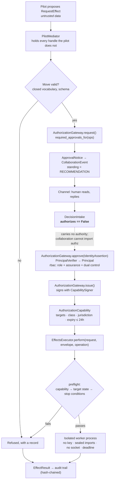

# The agent trust model

**Status:** `IMPLEMENTED` — every mechanism named below exists in the tree and is held to a
test. `PROPOSED` / `REQUIRES_EXTERNAL_DATA` where explicitly labelled, which is confined to
the [known weaknesses](#known-weaknesses) section and to the identity provider.

This document describes NEMESIS as it actually is, not as a zero-trust framework says an
agent platform should be. Where the framework asks for something NEMESIS does not have, the
gap is named. Where NEMESIS has something the framework does not ask for, it is here because
a review broke an earlier version without it.

---

## The trust equation

Trust in NEMESIS is not a property of a component. It is a conjunction, and every term has a
concrete type behind it. Nothing is trusted because of what it is; everything is trusted for
exactly one operation, for exactly as long as five separate things hold at once.

```
identity  +  policy  +  provenance  +  evidence  +  authorization
```

| Term | Question it answers | Type that provides it | File |
|---|---|---|---|
| **Identity** | Who is this, and how well do we know it? | `Principal`, `IdentityAssertion`, `PrincipalVerifier` | `src/nemesis/core/identity.py`, `src/nemesis/authz/attestation.py` |
| **Policy** | Is this identity entitled to this decision? | `AuthorizationGateway` + the `rbac` tables | `src/nemesis/authz/gateway.py`, `src/nemesis/authz/rbac.py` |
| **Provenance** | Where did this assertion come from, through what hands? | `ProvenanceChain` | `src/nemesis/core/provenance.py` |
| **Evidence** | Is the underlying material preserved and unaltered? | `EvidenceObject`, `FileSystemEvidenceVault` | `src/nemesis/core/evidence.py`, `src/nemesis/evidence/vault.py` |
| **Authorization** | May *this* act happen, against *this* target, *now*? | `AuthorizationCapability` | `src/nemesis/core/authorization.py` |

The terms compose and do not substitute. A verified identity with no capability may act on
nothing. A valid capability held by nobody in particular is unusable, because
`AuthorizationGateway.issue()` is reachable only through a request that was approved by a
verified `IdentityAssertion`. Perfect provenance on a claim authorizes nothing at all — it
tells you how much to believe the claim, which is a different question from what you may do
about it.

Two details are worth reading closely, because both were added after an adversarial pass
walked through the earlier version:

- **`Principal` cannot be constructed from a bare string by ordinary calling code.** It
  carries the assurance level and the provider name that established it. A caller inventing
  a principal would have to invent those too — visibly, in the audit record. Before this, the
  gateway took an actor id and a role as caller-supplied strings, and "dual control" meant
  *two distinct strings*.
- **`PrincipalVerifier.verify()` treats the assertion it is handed as an envelope and then
  discards it.** Every field the policy reads comes back out of
  `IdentityAssertion.from_signed_payload()` — the signed bytes, re-parsed through the model's
  validators. An adversarial review built an assertion whose roles serialized as `analyst`
  and compared as `legal_reviewer`: identical bytes, a genuine issuer signature, and a
  recorded legal review that never happened. Checking fields on the delivered object is
  checking the attacker's copy of the statement.

---

## The seven separations

Zero-trust framing reduces to a set of statements of the form *X is not Y*. Each one below is
paired with the NEMESIS mechanism that enforces it — not a convention, a mechanism.

### 1. Human ≠ trusted

A person is an identity plus a role plus an assurance level, checked separately every time.

`Role` (`core/identity.py`) is checked against roles the *provider* attached to the principal,
never a role string a caller supplied. `APPROVAL_ROLES` (`authz/rbac.py`) says which roles may
approve which operation class; `ANALYST` appears nowhere in it, because requesting is not
approving. `AUDITOR` appears nowhere either, so oversight never requires the ability to act.
`AuthorizationGateway` refuses a requester who approves their own request
(`SelfApprovalError`) and refuses one person supplying two decisions (`DuplicateApproverError`).

Separately, `MINIMUM_ASSURANCE` gates on *how well the person is known*, with
`DEFAULT_MINIMUM_ASSURANCE = HARDWARE_BACKED` for anything unlisted — so an operation class
added later inherits the tightest bar rather than the loosest.

### 2. Agent ≠ trusted

An agent has no ambient reach. `.importlinter` encodes plane separation as forbidden-import
contracts, and a violation is a security defect rather than a style issue. Two are directly
about this:

- `effects-no-ambient-authority` forbids `nemesis.effects` from importing the graph, the
  collection plane, pursuit, resolve, attribute, disrupt, evidence or collaboration. A
  compromised adapter is not an exfiltration path out of the investigation.
- `collectors-cannot-act` forbids `nemesis.collect` from importing effects, authz, disrupt or
  collaboration. The plane that handles hostile content sits upstream of nothing consequential.

At runtime, `src/nemesis/effects/isolation.py` launches the effect in a child process with no
private key (it gets a *verifying* key), no importable intelligence platform (the worker seals
graph, vault, collect, pursuit and the signing module before reading a byte of input), no
inherited environment, a deadline, and — on macOS, via `sandbox-exec` — no socket. What is not
claimed is stated in the same docstring: filesystem confinement and network denial come from
`sandbox-exec` and exist nowhere else, and the run reports what it actually got in an
`IsolationReport` rather than what the docstring hopes for.

### 3. Model ≠ trusted

The pilot is an external frontier model and is treated as an adversary, not a colleague.

- **The move vocabulary is closed.** `src/nemesis/pilot/moves.py` admits exactly `RunPivot`,
  `RecordBelief`, `RequestEffect`, `Conclude`, through a discriminated union. There is no
  `mint_capability`, no `widen_envelope`, no `assert_fact`, no `export`. Authority escalation
  is contained by the *absence of a verb*, which is stronger than a check on a verb that
  exists, because there is nothing to get wrong.
- **The pilot holds no handle.** `PilotMediator` (`src/nemesis/pilot/mediator.py`) is
  constructed with the pursuit engine, the graph, the capability envelope, the effects
  registry, the claim store and the audit sink. The pilot is constructed with none of them.
- **A model's output is data, revalidated at the seam.** Invariant 5 applied to the pilot
  itself, exactly as to content crossing the collection boundary.
- **A model cannot manufacture a fact.** A `RecordBelief` becomes a `Claim` of kind
  `HYPOTHESIS` derived from `MODEL_ASSERTION`. `Claim`'s own validator
  (`core/claims.py`) refuses to construct an `OBSERVATION` from anything but
  `DIRECT_COLLECTION` or `AUTHORITATIVE_RECORD`, and refuses a model-derived claim that does
  not name its model. That is invariant 1, enforced at construction.
- **The pilot cannot see persona linkage.** `pilot-cannot-reach-persona-linkage` forbids both
  `nemesis.pilot` and `nemesis.pilotbench` from importing `nemesis.resolve`.
- **Forging target state is impossible.** The mediator reads a target's current attributes
  *from the graph*. A pilot may name a target; it may not tell NEMESIS what that target
  currently looks like.

### 4. Tool ≠ trusted

An adapter re-checks everything its caller already checked, because a compromised caller is
precisely the threat. `src/nemesis/ports/effects.py` shapes the interface so the wrong thing
is hard: `execute` takes the capability as a required argument, there is no path that acts
without one, and the adapter re-verifies that capability itself.

`preflight()` in `src/nemesis/effects/registry.py` runs the verification in a deliberate order
— capability, then target state, then stop conditions — because a target-state check on an
unauthorized operation would leak that the target is known to us before establishing any right
to look at it. `sanitize()` flattens caller-supplied strings before they reach a document, so a
parameter carrying newlines cannot forge a NEMESIS artifact's banner lines.

The registry's most important behaviour is what it does for operation classes with **no
adapter**: it refuses, with a record. `MVP_IMPLEMENTED_OPERATIONS` is
`{SIMULATION, PROVIDER_NOTIFICATION, TAKEDOWN_REQUEST_DRAFT, EVIDENCE_EXPORT}` and nothing
else. Registrar suspension, hosting termination, account suspension, asset freeze, domain
seizure and sinkholing are declared classes with nothing to call.

### 5. Event ≠ true

Anything arriving from outside is data. `InboundSignal`
(`src/nemesis/collaboration/base.py`) is a deliberately *different type* from
`CollaborationEvent`, with a different name, so that no function accepts both. An outbound
event is a projection of something NEMESIS established; an inbound signal is
adversary-reachable text that happened to arrive over an authenticated socket.

`SignalKind.DECISION_INTENT` means a message *looked like* agreement. `SignalKind.UNPARSEABLE`
is kept rather than discarded, because "seven people replied and none of it parsed" is an
operational fact about a channel. `parse_collaboration_event()` recovering a NEMESIS envelope
from a channel message does **not** make it ours: the only thing that does is its `event_id`
matching one the outbox published.

`BuzzCollaborationProvider.poll` recomputes each event's id from its own fields — which catches
any modification of content or tags — and sets `author_verified=False` unless a signature check
actually ran. Since NEMESIS ships no BIP-340 implementation, no signature check runs, and the
signal says `signature_checked: "false"` in its metadata. It reports what it checked, never
what it hopes.

### 6. Signature ≠ authorization

This is the separation the whole collaboration plane exists to protect, and it is enforced
twice over.

**By type.** `DecisionIntake.authorizes` in `src/nemesis/collaboration/approvals.py` is a
property that returns `False` unconditionally, for every input, with the reasoning written at
the point of temptation. There is no `APPROVED` member of `DecisionIntent`, and there will not
be one: the type that carries an approval is `Approval`, minted by the gateway, and it cannot
be constructed in the collaboration plane. `ApprovalNotice` has no `status`, no `approved_by`,
no `approved_at` — there is no field on a published notice that could hold a decision.

**By the import graph.** The `collaboration-holds-no-handles` contract in `.importlinter`
forbids `nemesis.collaboration` from importing `nemesis.authz`, `nemesis.evidence`,
`nemesis.graph`, `nemesis.collect`, `nemesis.audit`, `nemesis.pursuit`, `nemesis.resolve`,
`nemesis.attribute`, `nemesis.disrupt`, `nemesis.effects`, `nemesis.pilot`, `nemesis.api`,
`nemesis.slice` or `nemesis.cli`. It names the *package*, not a list of modules, so it covers
the third backend nobody has written yet. The wall is a fact about the import graph, not a rule
someone has to remember.

What a signature does establish and what it does not:

> A collaboration backend can tell you **who signed a message**. Authorization additionally
> requires knowing that a person holding a role, at an assurance level this deployment
> accepts, decided about a specific operation against a specific target in a specific state,
> within a window, with a rationale recorded. No signature establishes any of that.

Two further bindings follow. A reply must quote a **proposal digest** — 16 hex characters
covering the capability id, the case, the operation, every target fingerprint in order, the
risk level and the close time — so a generic "approved" cannot be re-read as approving a
different proposal that reused the conversation. And `ApprovalNotice.intent_from()` refuses
*before it parses*: past `responses_close_at` it returns `REFUSED_EXPIRED` whatever the message
says, so a request that scrolled off the top of a channel three weeks ago cannot be revived by
rewording a reply.

The path from a channel reply to an actual grant runs entirely outside this plane:
`AuthorizationGateway.approve()` takes an `IdentityAssertion` — not a principal, not a name,
not a `DecisionIntake` — verifies it through `PrincipalVerifier`, and only
`AuthorizationGateway.issue()` mints signed bytes, reachable only with the `CapabilitySigner`
supplied at construction.

### 7. Recommendation ≠ decision

`EpistemicStanding` (`src/nemesis/collaboration/events.py`) is a closed vocabulary that keeps
these apart at the type level, and it is not a superset of `ClaimKind` — the bottom three
members name things that are not claims at all:

| Standing | What it is |
|---|---|
| `RECOMMENDATION` | A proposed course of action. Not a claim about the world, never stored as one, and it **authorizes nothing by existing**. |
| `DECISION` | Projects an `Approval` the gateway already recorded — never a chat message that reads like agreement. |
| `AUTHORIZED_ACTION` | Projects an `EffectResult` under a verified capability, *including a refusal*. |

`standing_of_claim()` is the only sanctioned way to obtain a standing for a claim. Callers do
not choose: the kind was fixed at construction by `Claim`'s validators, so a publication path
cannot upgrade what the domain model downgraded.

An `ApprovalNotice` is published at standing `RECOMMENDATION`, and its summary tells the reader
in words that a reply is not an authorization. `risk` is derived from the operation via
`OPERATION_RISK`, never supplied — and `OPERATION_RISK` is checked against the enforced sets at
import time, so the published classification cannot drift away from what the code does.

---

## NEMESIS's actual agent topology

**There is one model seat. Everything else is deterministic Python.**

This is the single most common misreading of the system, and it is worth being blunt: the
~10-agent roster that agent-platform designs assume — triage, intel, malware, infrastructure,
attribution, evidence, legal, disruption, supervisor — **does not exist here**. It was
considered and refused. The docstring of `src/nemesis/collaboration/identities.py` says why:
enrolling nine identities that no code drives would put nine names in a channel that never
speak, and a reader would reasonably conclude a multi-agent system was running.

`STANDING_ACTORS` lists the four actors that exist and can speak:

| Actor | Kind | What it is |
|---|---|---|
| `nemesis-pursuit` | `RULE` | Chooses the next pivot by deterministic rule policy. Replayable: same state, same decisions. |
| `nemesis-pilot` | `AGENT` | **The single seat an external, untrusted frontier model drives.** Four verbs, every move validated by the mediator, every move refusable. |
| `nemesis-authorization` | `SYSTEM` | Raises requests, records decisions, mints the signed capability. The only component that turns a decision into authority. |
| `nemesis-resurgence` | `RULE` | Watches for the reappearance of disrupted infrastructure. A takedown closes no case (invariant 14). |

Only `nemesis-pilot` carries a `model_identifier`. The field exists so a reader can tell which
messages in a channel a model wrote, which is the first thing anyone wants to know.

**Why this shape.** ADR-0008 records the founder's framing: NEMESIS is the framework an
autonomous frontier-model pilot drives — the car, the écurie, and above all the limiter that
keeps the pilot inside the track. The pilot is the brain and is external; NEMESIS is the part
that *must not be a model*, because the part that enforces the limits cannot be one an
adversary steers with the content it writes. "There is no LLM in the code" is therefore correct
by design rather than a gap.

The corollary is the one that matters for trust: a swarm of agents is a swarm of things to
contain. One seat with a four-verb vocabulary and a mediator holding every handle is a
containment problem you can write down, test, and prove. `RegisteredActor.declared_capabilities`
and `data_scopes` are prose for humans and for the profile a backend renders — they are
consulted by no check, and calling them permissions would be exactly the confusion this design
exists to prevent.

---

## What a cryptographic identity proves, and what it does not

**Proves:**

- These bytes were produced by the holder of this key, and have not changed since.
- Two messages signed by the same key came from the same key-holder — which is what makes a
  channel readable six months later, and what `ActorRegistry` exists to label.
- The bytes existed no later than the moment they were countersigned by something else
  (an anchor, a chained audit entry).

**Does not prove:**

- **That the content is true.** A signature over a false statement is a valid signature.
- **That the signer is who the key claims.** That requires an issuer this deployment
  registered, at a ceiling this deployment set — `RegisteredIssuer.assurance_ceiling`. An
  issuer states what it did; the deployment states what that issuer's word is worth here, and
  when they disagree the ceiling wins. A provider cannot promote itself.
- **That the key-holder is a person rather than a process that holds their key.**
- **That the signer may cause anything to happen.** Entitlement is a separate lookup against
  `APPROVAL_ROLES` and `MINIMUM_ASSURANCE`, and then against a capability.
- **That the message is recent, or about the thing you think it is about.** Hence the
  proposal digest and the hard close time.
- **That a stored signed event was not rewritten by whoever stores it.** The examined relay
  verifies at ingest, stores `verified: true`, and nothing re-checks on the read path.
- **That an unregistered key is anybody.** `ActorRegistry.actor_for_backend()` returns `None`
  for anything unenrolled. `None` is the important answer, not a fallback: the honest response
  to a message from a key nobody enrolled is "I do not know who that is", and naming them
  "unknown" in a way that reads like an actor would hide exactly that.

---

## The trust chain, from proposal to executed effect



The dotted edge is the load-bearing one. It is the only place a human's channel reply touches
the chain, and it carries **no** authority across: the intake is a reading of untrusted text,
and the arrow is a human then presenting a verified identity assertion to the gateway. Nothing
automated crosses it. `nemesis.collaboration` cannot import `nemesis.authz`, so there is no
code path that could.

---

## Known weaknesses

Every item here is real, self-documented in the code, and verified against the tree while
writing this. None is a hypothetical.

### 1. There is no identity provider. `REQUIRES_EXTERNAL_DATA`

The only identity provider in the repository is `LocalDevelopmentIdentityProvider`
(`src/nemesis/authz/providers.py`), named `local-development-fixture`. It authenticates
nothing: a credential is a display name, and presenting a name is not proof of anything. Its
`registered_issuer()` is capped at `AssuranceLevel.DEVELOPMENT`, always.

**What that means for dual control.** `check_dual_control()` counts *distinct authenticated
subjects*, so it is exactly as strong as the guarantee that one human cannot obtain two
subjects. The fixture mints a fresh subject for any display name presented, checking no
credential — **so one person enrolling twice clears dual control.** That is not a defect in
the function; it is what "we have no identity provider" means at this layer, and no code in
`authz/rbac.py` can fix it.

What *does* hold: `MINIMUM_ASSURANCE` lists `SIMULATION` at `DEVELOPMENT` and nothing else, so
a development principal can authorize a rehearsal and nothing that leaves the system. The
refusal is the control. It is not a configuration problem to work around.

This is also, deliberately, not disguised: a convincing fake authenticator would be worse than
none, because it produces audit records that look like logins and approvals that look reviewed.

### 2. The two-approver path is currently unreachable. `IMPLEMENTED` but dormant

`required_approvals_for()` (`src/nemesis/authz/gateway.py:76`) returns `2` if and only if the
requested operations intersect `IRREVERSIBLE_OPERATIONS`. Those two sets are disjoint:

- `MVP_IMPLEMENTED_OPERATIONS` = `SIMULATION`, `PROVIDER_NOTIFICATION`,
  `TAKEDOWN_REQUEST_DRAFT`, `EVIDENCE_EXPORT`
- `IRREVERSIBLE_OPERATIONS` = `REGISTRAR_SUSPENSION`, `HOSTING_TERMINATION`,
  `ACCOUNT_SUSPENSION`, `ASSET_FREEZE_REQUEST`, `DOMAIN_SEIZURE`, `SINKHOLE`

So **`required_approvals_for()` returns 1 for every operation class that has an adapter.** The
dual-control path exists only for `REQUIRES_LEGAL_AUTHORITY` classes that cannot be executed at
all. The code is kept and called anyway, because the day a class needs two people is not the
day to be writing it — but do not read "NEMESIS enforces dual control" as a statement about
anything NEMESIS can currently do.

### 3. No evidence package this build produces is defensible against its own operator. `REQUIRES_EXTERNAL_DATA`

Invariant 10 puts the vault operator inside the threat model, which makes the vault's own hash
chain circular: whoever can rewrite the log can recompute every link in it. Only an anchor held
by a party that is not us closes that.

The machinery is present and works: `FileSystemEvidenceVault.record_anchor()` binds an anchor
to the sequence whose head it covers and refuses an anchor over a head the chain never had;
`LocalHeadSigner` (`src/nemesis/evidence/anchoring.py`) signs a head with an Ed25519 key. But
that key is **ours**, so the anchor is stamped `LOCAL_ANCHOR_AUTHORITY = "nemesis"`, and
`IntegrityAnchor.is_externally_held` rejects exactly that value. External anchoring — RFC 3161,
a transparency log, a public ledger — has no implementation here, on purpose.

The consequence is arithmetic: `SealedExport.externally_anchored` is `0`, therefore
`SealedExport.is_defensible_against_operator` (`src/nemesis/evidence/export.py:185`) is
**`False` for every package this build can produce**, and the package says so on its face
(`NO_EXTERNAL_ANCHOR`). What a local anchor buys is real but narrow: it catches a store
restored from the wrong backup, a chain rebuilt by a repair script, an anchor copied in from
another vault. It catches nothing an operator with the signing key did on purpose.

The practical control shipped instead is the `seal_digest` — one 64-character string covering
the whole package, to be given to the recipient through a channel that is not the package. It
is the only check in the arrangement that does not run on data the sender controls.

### 4. The free-text disclosure guard catches markers, not paraphrase. `IMPLEMENTED`, and blunt on purpose

Founder decision D1 keeps persona linkage internal. It is enforced three ways: the external
product type has no field for it, redaction is counted and reported rather than silent, and —
the backstop — `scan_for_internal_material()` (`src/nemesis/core/disclosure.py`) scans every
free-text value crossing into Effects, and the same function runs at the collaboration boundary
in `CollaborationEvent`'s validator.

It is a substring match against seven literals: `persona_linkage`,
`PersonaLinkageAssessment`, `same_operator_as`, `human_identity_lead`, `identity_lead`,
`INTERNAL LEAD`, `internal_lead`.

**An analyst — or a pilot — determined to paraphrase a persona linkage into a takedown request
will succeed, and no code in this repository will stop them.** What the guard prevents is the
*accidental* path: a well-meaning caller passing an internal assessment's own rendered text
into a document because it was the field at hand. Its own docstring says the empty tuple means
"nothing was detected", which is not the same as nothing being there, and callers must not
describe it that way.

The controls that are not blunt are the structural ones: the type with no field for it, and the
`disruption-cannot-reach-persona-linkage` and `pilot-cannot-reach-persona-linkage` import
contracts.

---

## See also

| Question | File |
|---|---|
| Why one seat, and where the autonomy of an effect lives | `docs/adr/0008-the-pilot-seam-and-envelope-bounded-autonomy.md` |
| Why identity is established, not asserted | `docs/adr/0005-identity-is-established-not-asserted.md` |
| Why the capability is signed and verified by reconstruction | `docs/adr/0006-sign-the-object-verify-by-reconstruction.md` |
| Why the effects plane runs in its own process | `docs/adr/0007-process-isolation-for-the-effects-plane.md` |
| Why a collaboration backend is a provider, and reads from it authorize nothing | `docs/adr/0010-buzz-as-an-optional-collaboration-provider.md` |
| What the threat model assumes | `docs/architecture/THREAT_MODEL.md` |
| What exists and what works right now | `docs/architecture/PROJECT_STATE.md` |
| Standing up the collaboration backend | [`docs/development/buzz-local-setup.md`](../development/buzz-local-setup.md) |
